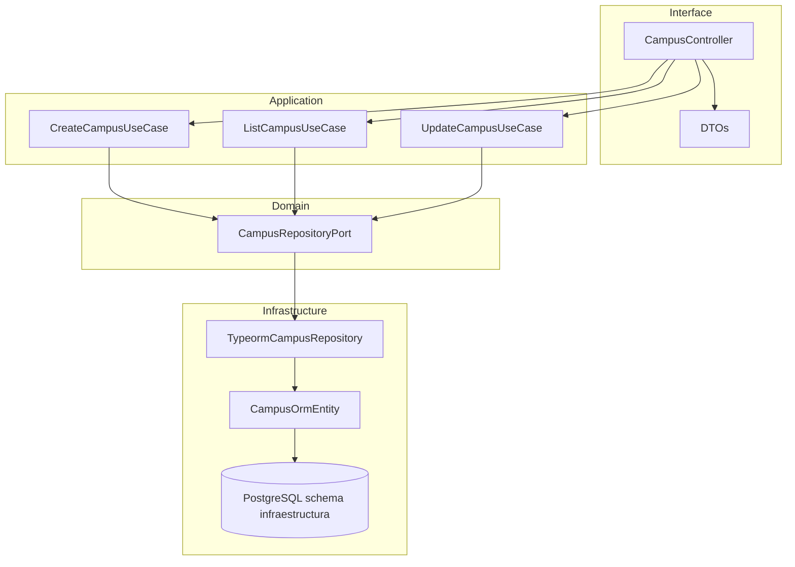

# Architecture Report

## Panorama general
- API HTTP construida con NestJS 11 orientada a gestionar infraestructura universitaria.
- Entrada en `src/main.ts` configura seguridad (Helmet), CORS, validacion global, prefijos y Swagger.
- `AppModule` ensambla configuracion (.env validado con Joi), conexion TypeORM a PostgreSQL y carga el `CampusModule` como primer bounded context.

## Stack tecnologico
- **Framework**: NestJS (`@nestjs/common`, `@nestjs/core`, `@nestjs/platform-express`).
- **Persistencia**: TypeORM 0.3, PostgreSQL (schema `infraestructura`), migraciones crudas (`src/migrations`).
- **Configuracion**: `@nestjs/config`, Joi para validar variables de entorno.
- **API y seguridad**: `@nestjs/swagger` + `swagger-ui-express`, Helmet, `@nestjs/throttler`.
- **Validacion de datos**: `class-validator`, `class-transformer`.
- **Utilidades**: RxJS para programacion reactiva.
- **Herramientas de desarrollo**: TypeScript 5.7, ts-node, tsconfig-paths, Jest + Supertest, ESLint, Prettier, pnpm, Nest CLI.

## Estructura de carpetas relevante
```text
.
- .vscode/
- src/
  - app.controller.ts
  - app.module.ts
  - app.service.ts
  - main.ts
  - config/
    - validation.ts
  - migrations/
    - 1758545008735-InitInfraestructura.ts
  - modules/
    - campus/
      - campus.module.ts
      - application/
        - create-campus.usecase.ts
        - list-campus.usecase.ts
        - update-campus.usecase.ts
      - domain/
        - campus.repository.port.ts
      - infrastructure/
        - campus.orm-entity.ts
        - campus.typeorm.repository.ts
      - interface/
        - campus.controller.ts
        - dto/
          - create-campus.dto.ts
          - list-campus.query.ts
          - update-campus.dto.ts
- test/
  - jest-e2e.json
- typeorm-cli.datasource.ts
- package.json
- README.md
```

## Capas y responsabilidades
- **Interface (api)**: `campus.controller.ts` expone rutas REST, traduce DTOs y delega en casos de uso.
- **Application**: `*.usecase.ts` orquestan reglas de negocio aplicando DTOs y comunicandose solo via puertos.
- **Domain**: `campus.repository.port.ts` define el contrato del repositorio (puerto hexagonal).
- **Infrastructure**: `campus.typeorm.repository.ts` y `campus.orm-entity.ts` implementan el puerto usando TypeORM.
- **Cross-cutting**: `AppModule` y `validation.ts` proveen configuracion global; migraciones mantienen sincronizacion con la base.

## Flujo de ejecucion
1. Cliente invoca endpoints del `CampusController`.
2. DTOs se validan via `ValidationPipe`; datos tipados llegan al caso de uso correspondiente.
3. Casos de uso interactuan con `CampusRepositoryPort` para ejecutar reglas (creacion, listado, actualizacion).
4. Implementacion TypeORM persiste datos y mapea entidades a objetos de dominio.

## Diagrama Mermaid


## Observaciones
- Arquitectura aplica una variante de DDD/hexagonal con capas separadas bajo `modules/<contexto>`.
- Validacion centralizada en `main.ts` provee respuestas consistentes; mantener prioridad de constraints actualizada.
- Migraciones TypeORM vacias de entidades requieren scripts SQL manuales alineados con los cambios en `campus.orm-entity.ts`.
- Considerar incorporar pruebas e2e en `test/` para cubrir flujos CRUD completos cuando se desplieguen mas modulos.
