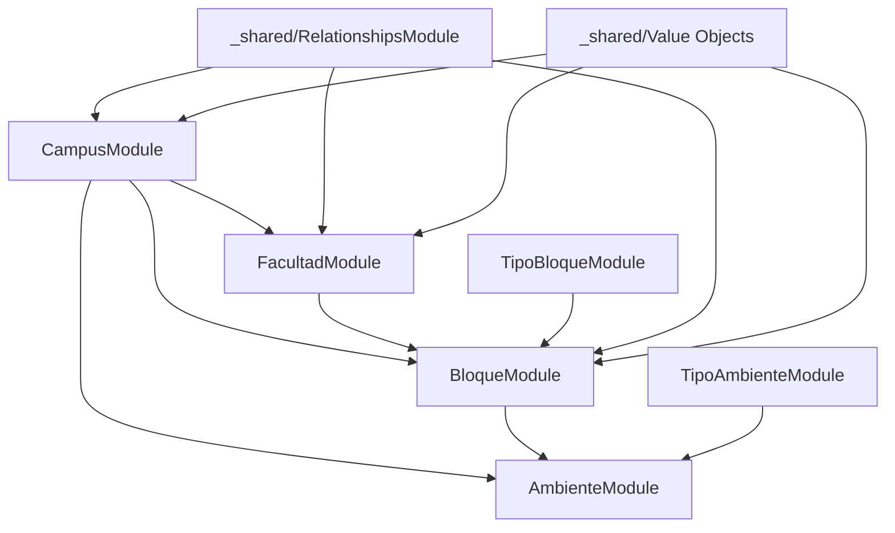

# Architecture Report

## Panorámica

Infraestructura UMSS expone una API HTTP en NestJS 11 para administrar campus, facultades, bloques, tipos de bloque/ambiente y ambientes. Cada feature vive en un módulo hexagonal (`interface → application → domain → infrastructure`). `src/main.ts` arma el runtime: Helmet, CORS estricto, prefijo global desde `.env`, validación consistente con `ValidationPipe` y documentación Swagger (`/api/docs` por defecto). `AppModule` registra configuración validada con Joi, inicializa TypeORM contra PostgreSQL y carga los bounded contexts de infraestructura.

### Arquitectura de software (visión macro)

```mermaid
graph TB
  subgraph Presentation
    swagger[Swagger UI]
    controllers[Controllers REST]
  end

  subgraph Application
    usecases[Use Cases\n(Application Services)]
    pipes[ValidationPipe + DTOs]
  end

  subgraph Domain
    ports[Repository Ports\n+ Value Objects]
    relPort[Relationships Port]
  end

  subgraph Infrastructure
    adapters[TypeORM Adapters]
    relAdapter[Relationships TypeORM Adapter]
    migrations[SQL Migrations]
  end

  subgraph Data
    postgres[(PostgreSQL Schema infraestructura)]
  end

  swagger --> controllers --> pipes --> usecases --> ports --> adapters --> postgres
  usecases --> relPort --> relAdapter --> postgres
  migrations --> postgres
```

## Stack resumido

- **Framework**: NestJS (`@nestjs/common`, `@nestjs/core`, `@nestjs/platform-express`).
- **Persistencia**: TypeORM 0.3 con migraciones SQL crudas en `src/migrations`, PostgreSQL (schema `infraestructura`).
- **Configuración**: `@nestjs/config` + `src/config/validation.ts`.
- **API**: Swagger via `@nestjs/swagger`, filtros y pipes personalizados.
- **Validación**: `class-validator` + `class-transformer` (pipes globales).
- **Herramientas**: TypeScript 5.7, pnpm, Jest, ESLint, Prettier, Nest CLI.

## Organización del código

```text
src/
 ├─ main.ts / app.module.ts / app.controller.ts
 ├─ config/validation.ts              # Esquema Joi del .env
 ├─ migrations/                       # 1758545008735-InitInfraestructura + seeds 1760000000001…0008
 └─ modules/
    ├─ campus/                        # CRUD de campus
    ├─ facultad/                      # CRUD + dependencias a campus
    ├─ tipo-bloque/
    ├─ bloque/
    ├─ tipo-ambiente/
    ├─ ambiente/
    └─ _shared/
         ├─ domain/value-objects/geo-point.vo.ts
         └─ relationships/            # Servicios transaccionales de cascadas
```

Cada módulo mantiene el mismo layout:

```
modules/<context>/
 ├─ interface/        # Controllers + DTOs Swagger
 ├─ application/      # Use cases (servicios)
 ├─ domain/           # Ports, entidades de dominio o tipos
 └─ infrastructure/   # Repositorios TypeORM / adapters
```

## Inventario de módulos

| Módulo                         | Responsabilidad                                                                                                      | Dependencias internas                                          |
| ------------------------------ | -------------------------------------------------------------------------------------------------------------------- | -------------------------------------------------------------- |
| `CampusModule`                 | CRUD de campus, expone controladores REST, valida DTOs y usa `GeoPoint` para coordenadas.                            | Ninguna (raíz de jerarquía).                                   |
| `FacultadModule`               | Maneja facultades ligadas a un campus, incluye casos de uso create/list/update/delete y orquesta cascadas de activo. | `CampusModule`, `_shared/relationships`.                       |
| `TipoBloqueModule`             | Catálogo global de tipos de bloque. Requiere saber si un tipo está asociado antes de eliminar.                       | `_shared/relationships`.                                       |
| `BloqueModule`                 | Gestiona bloques físicos (edificios). Valida dependencia contra facultad y tipo de bloque.                           | `FacultadModule`, `TipoBloqueModule`, `_shared/relationships`. |
| `TipoAmbienteModule`           | Catálogo global de tipos de ambiente.                                                                                | (Solo TypeORM).                                                |
| `AmbienteModule`               | CRUD de ambientes, filtros avanzados (paginación, booleanos) y validación de relaciones con bloques/tipos.           | `BloqueModule`, `TipoAmbienteModule`.                          |
| `_shared/relationships`        | Puerto y adapter TypeORM que ejecuta cascadas de activación/eliminación mediante SQL transaccional directo.          | Usa `@nestjs/typeorm` Datasource.                              |
| `_shared/domain/value-objects` | Value Objects reutilizables (ej. `GeoPoint`).                                                                        | Consumido por campus, facultad, bloque.                        |

### Topologia de modulos


```mermaid
graph TD
  campus[CampusModule]
  facultad[FacultadModule]
  tipoBloque[TipoBloqueModule]
  tipoAmbiente[TipoAmbienteModule]
  bloque[BloqueModule]
  ambiente[AmbienteModule]
  rels[_shared/RelationshipsModule]
  shared[_shared/Value Objects]

  campus --> facultad
  campus --> bloque
  campus --> ambiente
  facultad --> bloque
  bloque --> ambiente
  tipoBloque --> bloque
  tipoAmbiente --> ambiente
  rels --> campus
  rels --> facultad
  rels --> bloque
  shared --> campus
  shared --> facultad
  shared --> bloque
```

## Capas y flujo

```mermaid
flowchart LR
  subgraph Interface
    ctrl[Controllers REST]
    dto[DTOs con Swagger + class-validator]
  end
  subgraph Application
    uc[Use Cases\n(create/list/update/delete)]
  end
  subgraph Domain
    port[Repository Ports\n(+ value objects)]
  end
  subgraph Infrastructure
    repo[TypeORM Adapters]
    rel[Relationships Adapter]
    pg[(PostgreSQL\nschema infraestructura)]
  end
  ctrl -->|valida DTOs| uc
  uc --> port
  port --> repo
  repo --> pg
  uc --> rel
  rel --> pg
```

1. El controller recibe la petición, aplica DTOs con `ValidationPipe` (global).
2. El caso de uso transforma los datos (ej. interpreta booleanos de query, usa `GeoPoint` para POINT).
3. El puerto define qué operaciones necesita la capa de aplicación.
4. El repositorio TypeORM implementa dicho puerto y ejecuta SQL (ya sea mediante QueryBuilder o `queryRunner`).
5. Cuando se requiere cascada o verificación cruzada (ej. aseguran que al desactivar un campus se desactiven facultades, bloques y ambientes), se delega al `RelationshipsModule`, que encapsula transacciones explícitas y SQL raw.

## Cross-cutting

- **Validación y seguridad**: `main.ts` fuerza listas blancas, transforma datos y controla los mensajes de error priorizando constraints (`isDefined` → `maxLength`). Helmet y CORS están habilitados para los orígenes locales.
- **Configuración**: `ConfigModule` consume `envSchema` (DB host/port/name/user/password, `GLOBAL_PREFIX`, `NODE_ENV`). El CLI TypeORM (`typeorm-cli.datasource.ts`) también lee `.env`.
- **Documentación**: Swagger se publica bajo `${GLOBAL_PREFIX}/docs` y cada DTO define ejemplos compatibles con los endpoints.
- **Relationships Service**: `src/modules/_shared/relationships/domain/infraestructure/persistence/relationships.typeorm.repository.ts` ofrece dos familias de operaciones:
  - _Cascade soft toggle_: `markCampusCascadeInactive`, `markFacultadCascadeInactive`, `markBloquesCascadeInactive`.
  - _Cascade delete_: elimina jerarquías campus → facultad → bloque → ambiente y valida usos de tipos de bloque antes de borrarlos.
    Todo corre dentro de transacciones manuales y valida la estructura de filas devueltas.
- **Value Objects**: `GeoPoint` centraliza reglas de latitud/longitud y exporta literales compatibles con columnas `POINT`.

## Persistencia y migraciones

- `1758545008735-InitInfraestructura.ts` crea el schema `infraestructura` y tablas:
  - `campus` → `facultades` → `bloques` → `ambientes` (cadena jerárquica).
  - Catálogos `tipo_bloques`, `tipo_ambientes`.
  - `activos` (referenciando ambientes) preparado para futuras features.
  - Triggers PL/pgSQL: `tg_touch_actualizado_en` (actualiza `actualizado_en`), validadores JSON para `capacidad` y `dimension`.
- Seeds (`1760000000001`…`0006`) cargan catálogos y jerarquías iniciales coherentes con las entidades. `1760000000007` quedó vacía porque `tipo_activos` ya no existe y `1760000000008` inserta activos base usando solo columnas vigentes.
- TypeORM se ejecuta con `autoLoadEntities: true`, pero las migraciones están desacopladas y se mantienen en SQL manual; cualquier cambio de esquema debe duplicarse (SQL + repositorios).

## Ciclo de una petición

1. Cliente invoca `http(s)://host:${PORT}/${GLOBAL_PREFIX}/...`.
2. Nest resuelve el controller y la pipe global valida/transforma los payloads:
   - Booleans (`activo`, `clases`) usan transformadores explícitos (`ListAmbientesQueryDto`).
   - DTOs rechazan datos fuera de rango con mensajes localizados.
3. El caso de uso ejecuta validaciones adicionales (ej. existencia de FK mediante puertos o `RelationshipsPort`).
4. Repositorios TypeORM interactúan con Postgres:
   - Mapean JSONB (capacidad/dimensión).
   - Ejecutan transacciones cuando se necesita consistencia manual.
5. El resultado se devuelve como DTOs simples protegidos por `class-transformer`.

## Testing y calidad

- Cada DTO y use case tiene su propio `*.spec.ts` en el mismo directorio (por ejemplo `list-ambientes-query.dto.spec.ts`).
- El `_shared` module incluye specs de `GeoPoint` y del repositorio de relaciones para cubrir la lógica transaccional compleja.
- No hay e2e automatizados todavía; el folder `test/` mantiene la configuración base (`jest-e2e.json`) para habilitarlos cuando aparezcan nuevas historias.
- `pnpm lint` y `pnpm format` deben correr antes de subir cambios para asegurar reglas de importación y estilo.

## Lineamientos para extender la arquitectura

1. **Nuevos bounded contexts** deben respetar `modules/<context>/{interface,application,domain,infrastructure}` y exponer un `<Context>Module`.
2. **Dependencias** siempre apuntan hacia dentro del dominio (application → domain → infrastructure). Menciona si la pieza es Global/Local según la Scope Rule descrita en `AGENTS.md`.
3. **Persistencia**: cualquier tabla nueva se agrega al SQL de migraciones primero, luego al repositorio TypeORM correspondiente. Evitar `synchronize: true`.
4. **Validación**: añade DTOs con `class-validator` y documenta mediante `@nestjs/swagger`. Define transformadores específicos cuando la conversión implícita no sea suficiente.
5. **Cascadas**: reutiliza `RelationshipsPort` para actividades multi-tabla o crea un nuevo método dentro del mismo adaptor `_shared` para mantener toda la lógica transaccional centralizada.
6. **Pruebas**: escribe specs antes de implementar (TDD) y cubre caminos felices + bordes (ver `AGENTS.md`).

Este documento debe revisarse cada vez que:

- Se agregue un módulo o catálogo nuevo.
- Cambie la jerarquía de tablas o se introduzcan triggers adicionales.
- Se modifique la configuración global (p. ej. nuevos headers en CORS, autenticación).
